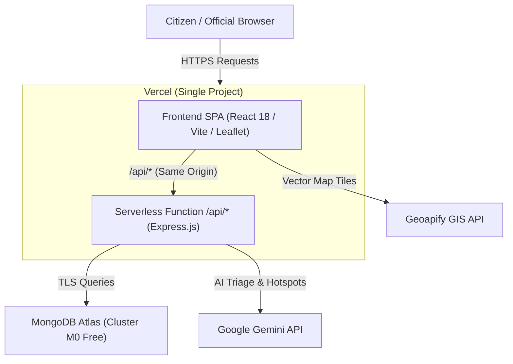

# CivicAI Vercel Serverless Deployment Guide

This guide details the single-platform deployment for **CivicAI** on **Vercel** using **Vercel Serverless Functions** (Express API) and **Vercel Static Hosting** (React + Vite SPA).

---

## 🏛️ Architecture Overview



### Why Vercel Serverless?
- **Zero Idle Spin-Down**: Unlike Render's free tier (which goes to sleep after 15 minutes and takes 50 seconds to wake up), Vercel serverless functions wake up instantly (~500ms).
- **Same-Domain (No CORS issues)**: Frontend and API share the exact same domain name (`your-app.vercel.app`), eliminating cross-origin errors completely.
- **One Project, One Dashboard**: No need to maintain separate hosting accounts and multiple Git connections.

---

## 📋 Pre-Deployment Checklist

- [ ] A [GitHub](https://github.com/) account with the `CivicAI` repository.
- [ ] A [MongoDB Atlas](https://www.mongodb.com/cloud/atlas/register) free M0 account.
- [ ] A [Google AI Studio](https://aistudio.google.com/app/apikey) Gemini API key.
- [ ] A [Geoapify](https://myprojects.geoapify.com/) API key.
- [ ] A [Vercel](https://vercel.com/) account.

---

## Step 1: Set Up MongoDB Atlas

1. **Create Free Database**:
   - Log into MongoDB Atlas, create a new deployment, and choose **M0 Free**.
   - Database Name: `civicai`.
2. **Create Database User**:
   - Go to **Database Access** > **Add New Database User**.
   - Set username & password. Assign **Read and write to any database**.
3. **Allow Network Access**:
   - Go to **Network Access** > **Add IP Address**.
   - Select **Allow Access From Anywhere** (`0.0.0.0/0`) since serverless functions run on dynamic cloud IPs.
4. **Copy Connection String**:
   - In **Database** > **Connect** > **Drivers**, copy the SRV URI:
     ```text
     mongodb+srv://<username>:<password>@cluster0.abcde.mongodb.net/civicai?retryWrites=true&w=majority
     ```

---

## Step 2: Generate Secrets & Gather Keys

1. **Google Gemini API Key**:
   - Get your key from [Google AI Studio](https://aistudio.google.com/app/apikey).
2. **Geoapify API Key**:
   - Get your key from [Geoapify Dashboard](https://myprojects.geoapify.com/).
3. **JWT Secret**:
   - Generate a 32-byte secret in your terminal:
     ```bash
     node -e "console.log(require('crypto').randomBytes(32).toString('hex'))"
     ```

---

## Step 3: Deploy Directly to Vercel

1. **Import Repository**:
   - Go to [Vercel Dashboard](https://vercel.com/dashboard).
   - Click **Add New...** > **Project**.
   - Select your `CivicAI` repository and click **Import**.

2. **Project Settings**:
   - **Framework Preset**: `Vite` (or `Other`)
   - **Root Directory**: `./` *(leave as default root)*
   - **Build Command**: `cd client && npm install && npm run build` *(auto-configured)*
   - **Output Directory**: `client/dist` *(configured in `vercel.json`)*

3. **Configure Environment Variables**:
   Under **Environment Variables**, add the following 5 keys:

   | Variable Name | Value | Description |
   | :--- | :--- | :--- |
   | `NODE_ENV` | `production` | Enables production mode |
   | `MONGO_URI` | `mongodb+srv://.../civicai?retryWrites=true&w=majority` | Atlas SRV URI |
   | `JWT_SECRET` | `your_generated_32_byte_secret` | Secure auth token signing |
   | `GEMINI_API_KEY` | `AIzaSy...` | Google AI Studio Key |
   | `VITE_GEOAPIFY_API_KEY` | `your_geoapify_key` | Geoapify key for frontend GIS maps |
   | `GEOAPIFY_API_KEY` | `your_geoapify_key` | Geoapify key for backend geocoding |

4. **Deploy**:
   - Click **Deploy**.
   - Vercel will install dependencies, compile the client into `client/dist`, bundle the `/api/index.js` serverless function, and assign your live production URL (e.g., `https://civicai-app.vercel.app`).

---

## Step 4: Verify Deployment

1. **Health Check Endpoint**:
   Visit:
   ```text
   https://your-app.vercel.app/api/health
   ```
   Expected response:
   ```json
   {
     "status": "ok",
     "service": "CivicAI API",
     "server": "running",
     "database": {
       "status": "connected",
       "connected": true
     }
   }
   ```

2. **Frontend UI**:
   - Open `https://your-app.vercel.app` in your browser.
   - Register a user, file a complaint with AI classification, view GIS heatmaps, and test the Admin dashboard.
