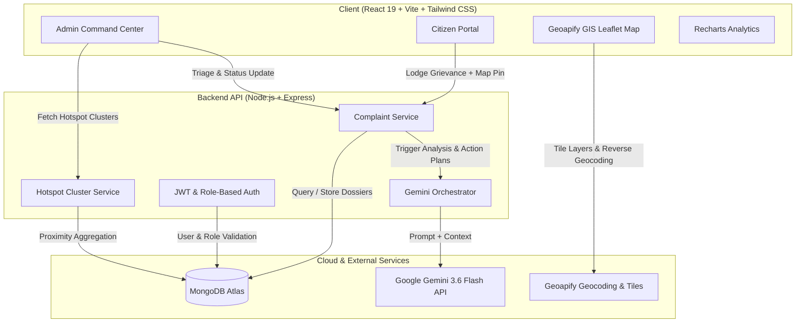

# CivicAI 🏛️🤖
### AI-Powered Digital Public Infrastructure for Municipal Governance & Grievance Resolution

[](https://civic-ai-mocha.vercel.app/)
[](https://ai.google.dev/)
[](https://www.geoapify.com/)
[](https://www.mongodb.com/atlas)

> **Live Production App:** [https://civic-ai-mocha.vercel.app/](https://civic-ai-mocha.vercel.app/)

---

## 📌 Executive Summary

**CivicAI** is a full-stack, AI-native GovTech Digital Public Infrastructure (DPI) platform designed to bridge the trust and efficiency gap between citizens and municipal authorities. 

Citizens can lodge infrastructure grievances with interactive GIS map pinning and AI-assisted triage. Public works officials and municipal commissioners gain an intelligent **Command Center** featuring automated hazard scoring, GIS radar cluster heatmaps, duplicate detection, and **Gemini-powered intervention recommendations** for immediate field crew dispatch.

---

## ⚡ Instant Demo Credentials

Pre-seeded demo credentials for testing (with a quick **Fill credentials** helper on the [Login Page](https://civic-ai-mocha.vercel.app/login)):

| Role | Demo Email | Password | Primary Capabilities |
| :--- | :--- | :--- | :--- |
| 👤 **Resident Citizen** | `citizen@civic.org` | `password123` | Pin-drop complaint filing, image evidence upload, personal grievance ledger & SLA tracking |
| 🏛️ **Municipal Officer** | `admin@municipal.gov.in` | `adminpassword123` | City-wide triage desk, GIS Hotspot Heatmap (150–300m radar clustering), Gemini AI action plans, Recharts city analytics |

> 💡 **Quick Switcher:** Once logged in, you can instantly toggle between Citizen and Officer views using the **`⇄ Switch to Officer / Citizen View`** button in the sidebar.

---

## 🌟 Core Features & Hackathon Checklist

### 1. 📝 Citizen Grievance Portal
- **Interactive Map Pinning**: Click anywhere on the Geoapify Leaflet map or search by street name/landmark for pinpoint geolocation.
- **Multimodal Evidence**: Attach photographic proof with instant thumbnail preview.
- **Personal Grievance Ledger**: Real-time status badge tracking (`Submitted` → `Under Review` → `In Progress` → `Resolved`).
- **Transparency Dossier**: Inspect department assignment, verified address, and incident timestamps.

### 2. 🧠 Google Gemini 3.6 Flash AI Engine
- **Automated Categorization**: Accurately classifies grievances into civic departments (*Roads & Bridges, Water Supply & Sewage, Solid Waste Management, Street Lighting, Drainage & Stormwater, Public Transit*).
- **Hazard & Priority Scoring**: Quantifies risk on a 0–100 scale and sets urgency tier (*Critical, High, Medium, Low*).
- **Spatial Duplicate Detection**: Compares incoming reports against active nearby complaints using semantic proximity to prevent municipal ticket bloat.
- **Municipal Action Plan Synthesis**: Generates field intervention steps, required heavy machinery/materials, and safety protocols for public works engineers.

### 3. 🗺️ Authority Command Center & GIS Hotspot Heatmap
- **City-Wide GIS Heatmap**: Interactive Leaflet map displaying live incident markers with severity-coded color schemes.
- **Radar Cluster Detection**: Groups proximate complaints (within 150m–300m) into pulsating hotspot clusters with composite severity scores.
- **Interactive Triage Workflow**: Update status directly from the dossier with instant state synchronization across the platform.

### 4. 📊 Municipal Analytics & Reporting
- **Incident Influx Trends**: Area charts tracking incoming grievances over time.
- **Resolution Distribution**: Donut and bar charts breaking down department workload and resolution rates.
- **Ward-Level KPIs**: Real-time counters for active reports, high-hazard escalations, and verified completions.

---

## 🏗️ System Architecture



---

## 🛠️ Technology Stack

| Domain | Technology | Purpose |
| :--- | :--- | :--- |
| **Frontend Framework** | React 19, Vite | Ultra-fast client build and modular SPA structure |
| **Styling & Icons** | Tailwind CSS v4, Lucide React | Modern civic-tech design system and accessible icons |
| **Mapping & GIS** | Leaflet, React Leaflet, Geoapify API | Reverse geocoding, interactive coordinate picker, hotspot overlays |
| **Data Visualizations** | Recharts | Interactive time-series and workload distribution charts |
| **Backend Framework** | Node.js, Express.js (ES Modules) | High-performance RESTful micro-services architecture |
| **Database & ODM** | MongoDB Atlas, Mongoose | Flexible NoSQL schema with geospatial indices |
| **AI / LLM Integration** | Google Gemini 3.6 Flash (`@google/genai`) | Autonomous categorization, severity scoring, duplicate check, and intervention synthesis |
| **Authentication** | JSON Web Tokens (JWT), bcryptjs | Secure stateless auth with strict role separation (`citizen` vs `admin`) |
| **Hosting & Deployment** | Vercel | Production cloud deployment |

---

## 📡 REST API Reference

### Authentication (`/api/auth`)
- `POST /api/auth/register` — Register new citizen or municipal user.
- `POST /api/auth/login` — Authenticate user and receive signed JWT.
- `GET /api/auth/me` — Fetch currently authenticated user profile.

### Grievances (`/api/complaints`)
- `POST /api/complaints` — Submit a complaint (triggers Gemini AI pipeline + Geoapify coordinates).
- `GET /api/complaints` — List complaints (filtered by user for citizens; city-wide for admins).
- `GET /api/complaints/:id` — Detailed complaint dossier including AI analysis and timeline.
- `PATCH /api/complaints/:id/status` — *(Admin Only)* Update triage status (`Submitted`, `Under Review`, `In Progress`, `Resolved`).

### GIS Hotspots & Intelligence (`/api/hotspots`, `/api/recommendations`, `/api/analytics`)
- `GET /api/hotspots` — Calculate spatially clustered infrastructure issues with risk weights.
- `GET /api/recommendations` — Fetch Gemini-synthesized municipal intervention roadmaps.
- `GET /api/analytics/overview` — Aggregated ward-level counts, department loads, and resolution metrics.

---

## 💻 Local Development Setup

### Prerequisites
- Node.js (v18 or higher)
- npm or yarn
- MongoDB connection string (local or MongoDB Atlas)
- Google Gemini API Key ([Google AI Studio](https://aistudio.google.com/))
- Geoapify API Key ([Geoapify](https://myprojects.geoapify.com/))

---

### Step 1: Clone Repository
```bash
git clone https://github.com/debiprasad229/CivicAI.git
cd CivicAI
```

### Step 2: Configure & Start Backend
```bash
cd server
npm install
```

Create a `.env` file in `server/`:
```env
PORT=5000
MONGO_URI=your_mongodb_atlas_connection_string
GEMINI_API_KEY=your_gemini_api_key
GEOAPIFY_API_KEY=your_geoapify_api_key
JWT_SECRET=your_super_secret_jwt_key
CLIENT_URL=http://localhost:5173
```

Start the backend:
```bash
npm run dev
```
*(Backend runs at `http://localhost:5000`)*

---

### Step 3: Configure & Start Frontend
```bash
cd ../client
npm install
```

Create a `.env` file in `client/`:
```env
VITE_API_URL=http://localhost:5000/api
VITE_GEOAPIFY_API_KEY=your_geoapify_api_key
```

Start the Vite development server:
```bash
npm run dev
```
*(Frontend runs at `http://localhost:5173`)*

---

## 🔒 Security & Privacy Practices

- **Zero API Key Leakage**: `GEMINI_API_KEY`, `MONGO_URI`, and `JWT_SECRET` are strictly kept server-side and never bundled in client code.
- **Client Geoapify Safety**: Only the frontend geocoding map key is exposed via `VITE_GEOAPIFY_API_KEY`.
- **Role-Based Access Control (RBAC)**: Protected route guards enforce separation so citizen tokens cannot access `/app/admin` or administrative endpoints.
- **Input Sanitization**: Passwords hashed with `bcryptjs` salt rounds; MongoDB inputs sanitized against NoSQL injection.

---

## 👥 Authors & Acknowledgments

- **Developed for:** AI for Communities & GovTech Civic Hackathon
- **Special Thanks:** Built with Google Gemini 3.6 Flash, Geoapify GIS Platform, and OpenStreetMap Contributors.

---
*GovTech Digital Public Infrastructure (DPI) • Built with ❤️ for Smarter, Resilient Cities.*
